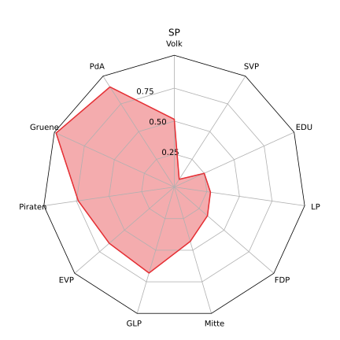
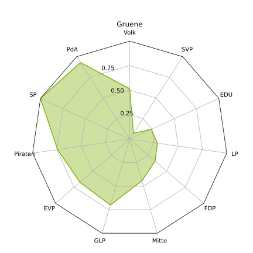
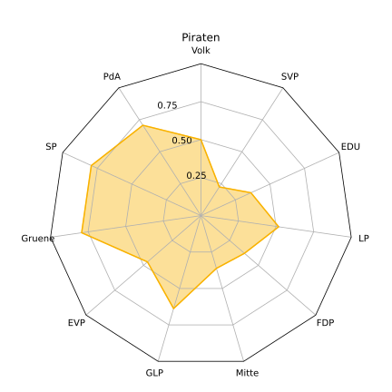
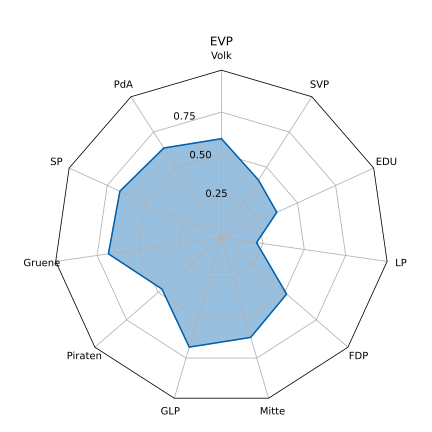
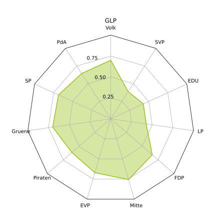
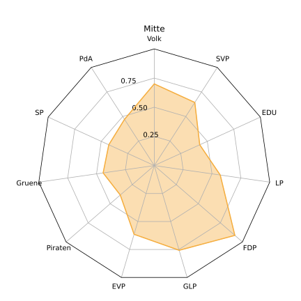
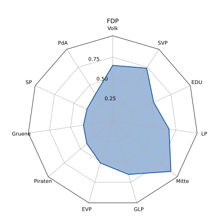
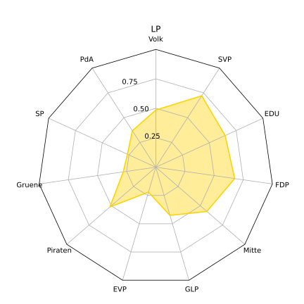
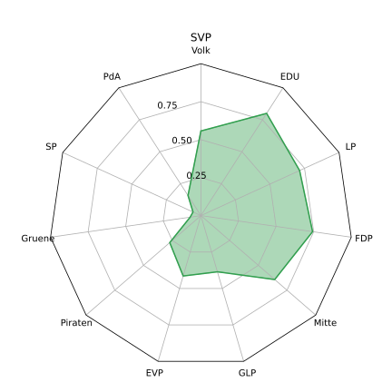

# Abstract
Das kleine Programm vergleicht die Abstimmungsempfehlungen (Parolen) der grössten Schweizer Parteien und berechnet einen Score, der zeigen soll, wie einig sich die Parteien sind.

# Resultate

# Wie wird der Score berechnet?
Die Abstimmungsparolen der Parteien für die einzelnen Abstimmungen sind wie folgt encodiert: 1 = Ja, -1 = Nein, 0 = Stimmfreigabe. 

Pro Partei ergibt sich so für alle $n$ Abstimmungen je ein Vektor $\vec{v_i} \in \{-1, 0, 1\}^n$. Der Score von zwei Parteien ist die Länge des Vektor, der aus der Orthogonalprojektion der beiden Vektoren resultiert, transformiert ins Intervall $[0,1]$. Die Formel dafür lautet:

$$\text{score}_\vec{v_i}(\vec{v_j}) = \dfrac{1}{2}\left(\dfrac{\langle\vec{v_i},\vec{v_j}\rangle}{\langle\vec{v_i},\vec{v_i}\rangle}+1\right)$$

# Disclaimer
Die Daten sind unvollständig für:

* Piratenpartei
    * Parolen für die Abstimmungen vom 28.09.2020 stammen von der Kantonalsektion beider Basel
    * Parolen fehlen für: 
        * Ehe für alle
        * 99%-Initiative
        * Freihandelsabkommen Indonesien
        * Initiative "Mehr bezahlbare Wohnungen"